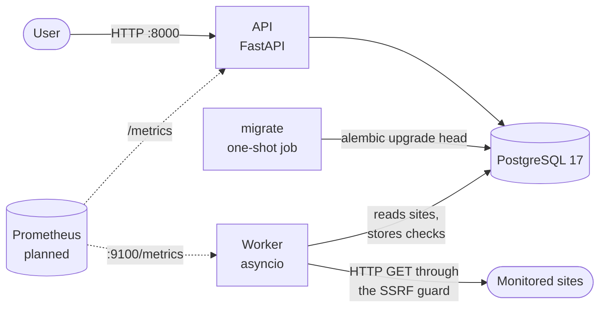

# pulseWatch

[](https://github.com/ShymonFzl/pulseWatch/actions/workflows/ci.yml?query=branch%3Amain)

Uptime monitoring platform: register websites, and a worker checks them at a regular interval and records whether they are up. Built as a DevOps portfolio project with production practices: hardened containers, CI with security scanning, architecture decision records, and later infrastructure as code, GitOps and observability.

## Status

**v0.1** runs locally with Docker Compose:

- HTTP API to add, list, read and delete the monitored sites
- polling worker with SSRF protection, storing every check in PostgreSQL
- Prometheus metrics for the API and the worker
- multi-stage, non-root, read-only container images
- CI: lint, type checks, tests against PostgreSQL, image build, Trivy vulnerability scan, and a weekly rescan of `main`

What comes next is listed in the [roadmap](#roadmap).

## Architecture



| Component | Role | Decisions |
|---|---|---|
| **API** | FastAPI app: site management, liveness (`/health`) and readiness (`/health/ready`) probes, `/metrics` | [ADR 0008](docs/adr/0008-prometheus-metrics.md) |
| **Worker** | Separate process: probes every site at a fixed interval (60 s by default) with bounded concurrency, stores one check per site and tick, serves its metrics on port 9100 | [ADR 0005](docs/adr/0005-worker-model.md), [ADR 0007](docs/adr/0007-ssrf-protection.md) |
| **migrate** | One-shot job that applies the Alembic migrations before the API and the worker start | [ADR 0002](docs/adr/0002-data-access-sqlalchemy-alembic.md) |
| **PostgreSQL** | Tables `sites` and `checks`; deleting a site deletes its checks | [ADR 0001](docs/adr/0001-python-and-postgresql-versions.md) |

The worker only connects to public addresses. Every connection resolves the host, rejects private, loopback and link-local addresses (including the cloud metadata service `169.254.169.254`), and connects to the validated address. Redirects are checked hop by hop. See [ADR 0007](docs/adr/0007-ssrf-protection.md).

## Quick start

Prerequisites: [Docker](https://docs.docker.com/get-docker/) with Compose v2, and Git.

```bash
git clone https://github.com/ShymonFzl/pulseWatch.git
cd pulseWatch
cp .env.example .env
```

Edit `.env` and set your own `POSTGRES_PASSWORD`, using letters, digits, `-`, `_` or `.` only (it goes into a database URL). Then start the stack:

```bash
docker compose up -d --build --wait
```

`--wait` returns once the database, the API and the worker are healthy and the migrations have run. The ports are only published on `127.0.0.1`:

| Service | URL |
|---|---|
| API | http://127.0.0.1:8000 (interactive docs at http://127.0.0.1:8000/docs) |
| Worker metrics | http://127.0.0.1:9100/metrics |
| PostgreSQL | `127.0.0.1:5432` |

Stop it with `docker compose down`. Add `-v` to also delete the database volume.

## Using the API

Add a site to monitor (only `http` and `https` URLs are accepted):

```bash
curl -s -X POST http://127.0.0.1:8000/sites \
  -H 'Content-Type: application/json' \
  -d '{"name": "Example", "url": "https://example.com"}'
```

```json
{"id":1,"name":"Example","url":"https://example.com/","created_at":"2026-09-29T12:00:00.000000Z"}
```

List, read and delete sites:

```bash
curl -s http://127.0.0.1:8000/sites
curl -s http://127.0.0.1:8000/sites/1
curl -s -o /dev/null -w '%{http_code}\n' -X DELETE http://127.0.0.1:8000/sites/1
```

| Case | Status |
|---|---|
| Site created | `201`, with a `Location` header |
| Site deleted | `204` |
| Unknown site | `404` |
| Same URL added twice | `409` |
| Invalid input (scheme, URL with credentials, empty name…) | `422` |

Health and metrics:

```bash
curl -s http://127.0.0.1:8000/health          # {"status":"ok"}: the process is alive
curl -s http://127.0.0.1:8000/health/ready    # 200 when the database is reachable, 503 otherwise
curl -s http://127.0.0.1:8000/metrics         # Prometheus metrics of the API
```

### Watching the results

v0.1 has no API endpoint for the checks yet. After adding a site, the worker probes it at its next tick (within `PROBE_INTERVAL_SECONDS`, 60 s by default). You can then follow the results in two ways.

In the worker metrics, `1` means up and `0` means down:

```bash
curl -s http://127.0.0.1:9100/metrics | grep '^pulsewatch_site_up'
```

In the database:

```bash
docker compose exec db sh -c 'psql -U "$POSTGRES_USER" -d "$POSTGRES_DB" -c \
  "SELECT site_id, checked_at, ok, status_code, response_time_ms, error FROM checks ORDER BY checked_at DESC LIMIT 10"'
```

Blocked targets (private or internal addresses) are recorded as failed checks, with an error starting with `blocked_address`.

## Configuration

Settings are read from environment variables. `docker compose` takes them from `.env`, which is ignored by Git.

| Variable | Default | Used by | Description |
|---|---|---|---|
| `POSTGRES_USER`, `POSTGRES_PASSWORD`, `POSTGRES_DB` | none (required) | compose | Database credentials; compose builds the connection URL from them |
| `DATABASE_URL` | none (required) | API, worker, tests | `postgresql+psycopg://…`; set by compose inside the containers, and read from `.env` when running from the host |
| `PROBE_INTERVAL_SECONDS` | `60` (min `5`) | worker | Interval between two ticks |
| `PROBE_TIMEOUT_SECONDS` | `10` (max `60`) | worker | Time budget of one probe, redirects included |
| `PROBE_CONCURRENCY` | `20` | worker | Maximum number of probes in parallel |
| `METRICS_HOST` | `127.0.0.1` (`0.0.0.0` in the worker image) | worker | Bind address of the metrics server |
| `METRICS_PORT` | `9100` | worker | Port of the metrics server |

Tool and image versions are listed in [docs/versions.md](docs/versions.md).

## Development

Prerequisites: [uv](https://docs.astral.sh/uv/) (it installs Python 3.14 if needed) and Docker for the database.

```bash
uv sync                          # create .venv with the locked dependencies
uv run pre-commit install        # run the checks on every commit
docker compose up -d db          # database only
```

If you changed `POSTGRES_PASSWORD` in `.env`, update it in `DATABASE_URL` too: that URL is the one used from the host.

Quality checks, the same as CI:

```bash
uv run ruff check && uv run ruff format --check
uv run mypy
uv run pytest
```

Tests that need the database are skipped locally when it is not running, and fail in CI.

Run the applications from the host, with the database from compose. Stop the `api` and `worker` containers first if they are running, since they use the same ports:

```bash
uv run alembic upgrade head
uv run uvicorn --factory pulsewatch.api.main:create_app --reload
uv run python -m pulsewatch.worker
```

After a model change, create the migration, review it, then apply it:

```bash
uv run alembic revision --autogenerate -m "describe the change"
uv run alembic upgrade head
```

### Project layout

```
src/pulsewatch/
  api/        FastAPI app, routes, schemas, HTTP metrics
  db/         SQLAlchemy models, engine and sessions
  worker/     polling loop, HTTP probe, SSRF guard, worker metrics
  config.py   settings (environment variables)
migrations/   Alembic migrations
tests/        unit and integration tests
docs/adr/     architecture decision records
Dockerfile    api and worker images
compose.yaml  local stack
```

## Security notes

- **No authentication yet.** Anyone who can reach the API can add or delete sites. Keep it on `127.0.0.1` until authentication lands ([#29](https://github.com/ShymonFzl/pulseWatch/issues/29)).
- **`/metrics` is served on the API port.** It must not be routed publicly ([ADR 0008](docs/adr/0008-prometheus-metrics.md); dedicated port planned in [#28](https://github.com/ShymonFzl/pulseWatch/issues/28)).
- **Hardened images.** They run as a non-root user (UID 10001) with a read-only root filesystem, and they contain no build tools and no pip.
- **Secrets stay out of the repository.** Locally they live in `.env`; the deployment will use AWS Secrets Manager and OIDC.

## Roadmap

- **v0.2**: publish the images to Amazon ECR through GitHub OIDC ([ADR 0006](docs/adr/0006-container-registry.md)), with the AWS infrastructure described in Terraform.
- **Later**: Kubernetes deployment managed with GitOps, Prometheus and Grafana dashboards and alerts, API authentication.

Issues and milestones are tracked on [GitHub](https://github.com/ShymonFzl/pulseWatch/issues).

## Contributing

- Decisions are recorded as ADRs in [docs/adr/](docs/adr/README.md).
- One issue per task and one pull request per change, merged by squash.
- Conventional commit messages. Issues, pull requests and commits are written in English.
- CI must be green: `lint`, `test`, `image (api)`, `image (worker)` and `container-config` are required on `main`.

## License

[MIT](LICENSE)
